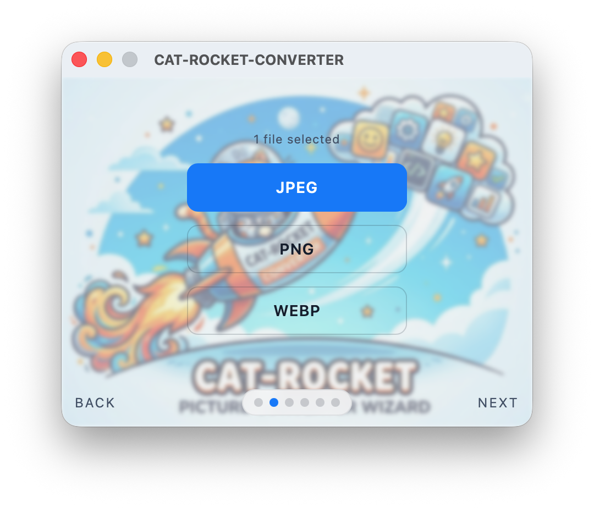
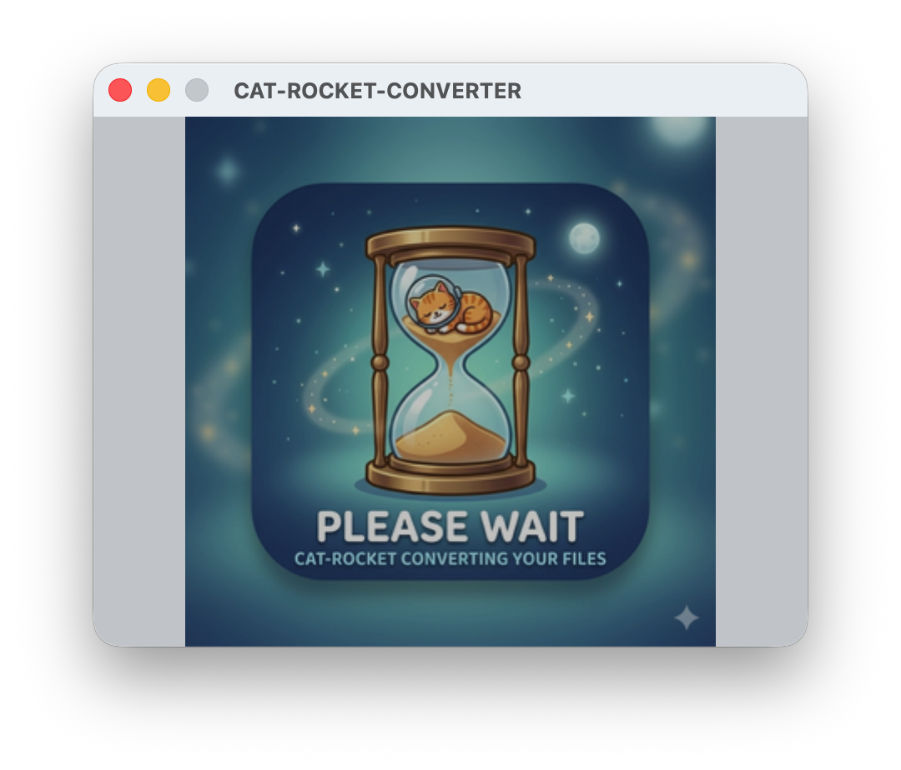

# Cat-rocket-converter

A tiny, blazing-fast image converter for macOS. Lives in your system tray, opens into a wizard-style window, and converts HEIC/JPEG/PNG pictures into JPEG, PNG, or WebP with pixel-level resize controls and smart batch renaming.

Built with [Tauri](https://tauri.app) + Rust + Svelte.

<p align="center">
  
  
</p>

---

## Features

- **HEIC decoding** — handles iPhone photos natively, including auto-rotation via `sips`
- **3 output formats** — JPEG, PNG, WebP
- **JPEG quality slider** — 1 to 100 with real-time file-size estimation
- **Resize panel** — sync percent and pixel dimensions, lock aspect ratio, or set exact sizes
- **5 resize algorithms** — Nearest, Bilinear, CatmullRom, Lanczos3, Gaussian
- **Batch rename patterns** — datetime prefix, original suffix, sequential numbering, or keep original names
- **System tray** — app hides to tray on close, stays alive until Quit
- **Waiting screen** — shows a custom artwork while conversion runs
- **Completion sound** — plays macOS Glass.aiff on success, then auto-hides to tray
- **Finder integration** — Right-click any image > Open With > Cat-rocket-converter

---

## Wizard Screens

| Step | Description |
|------|-------------|
| **1. Drop** | Drag and drop pictures or click OPEN to browse |
| **2. Format** | Choose JPEG, PNG, or WebP |
| **3. Quality** | Adjust JPEG quality (auto-skipped for PNG/WebP) |
| **4. Resize** | Set percent or pixel dimensions, pick an algorithm |
| **5. Rename** | Configure batch naming and preview filenames |
| **6. Save** | Pick a folder, watch progress, done! |

---

## Supported Formats

### Input
- HEIC / HEIF
- JPEG / JPG
- PNG

### Output
- JPEG (quality 1–100)
- PNG (lossless)
- WebP

---

## Resize Algorithms

| Algorithm | Speed | Look | Best use |
|-----------|-------|------|----------|
| Nearest | Fastest | Pixelated | Pixel art, draft previews |
| Bilinear | Fast | Soft and simple | Quick everyday downsizing |
| CatmullRom | Medium | Balanced sharpness | General-purpose exports |
| Lanczos3 | Slower | Sharpest detail | Best quality final output |
| Gaussian | Slower | Soft, blurry | Intentional smoothing |

---

## Install

1. Download the latest `.dmg` from [Releases](https://github.com/dixinode/cat-rocket-converter/releases)
2. Drag `Cat-rocket-converter.app` into `/Applications`
3. Launch once, then use the tray icon to show or hide the window

> **Note:** The app is currently unsigned. On first launch, right-click the app in Finder and select Open, then confirm in the Gatekeeper dialog.

---

## Build from Source

```bash
npm install
npm run tauri build
```

Output:
```
src-tauri/target/release/bundle/dmg/Cat-rocket-converter_*.dmg
src-tauri/target/release/bundle/macos/Cat-rocket-converter.app
```

---

## Development

| Layer | Technology |
|-------|------------|
| Shell | Tauri v2 |
| Backend | Rust (image, rayon, mozjpeg, webp) |
| Frontend | Svelte 5 + Vite |
| IPC | Tauri Commands |

- Frontend source: `src/`
- Rust backend: `src-tauri/`
- Canvas rule: always 428×318 px, non-resizable
- Background: `page1_background.png` with blur overlay on every page

### Commands

```bash
npm run dev          # dev server with hot reload (cargo tauri dev)
npm run tauri build  # production .dmg
cargo test           # Rust unit tests
```
